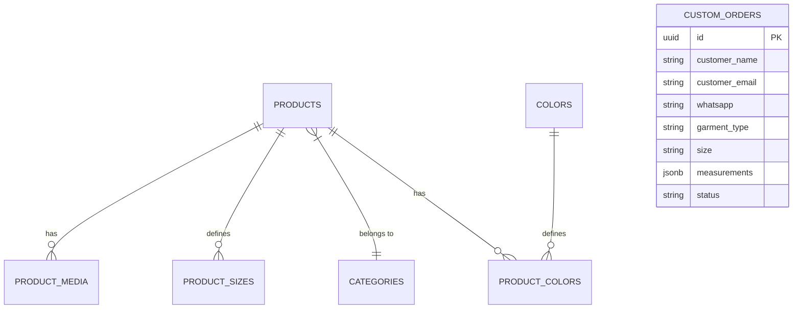

# 🪡 Dahila Crochet — Boutique E-Commerce & Admin Platform

> Un e-commerce boutique y panel de control a medida para una marca premium de moda artesanal en Uruguay. Diseñado con una experiencia visual de alta gama y arquitectura de software moderna.

Este proyecto representa la transición completa de una marca física y artesanal hacia el comercio electrónico moderno. No se trata simplemente de un catálogo estático; es una plataforma integrada que aborda el desafío de la venta de **prendas personalizadas y hechas a medida**, combinando la flexibilidad de la compra rápida con un embudo de personalización de talle, colores y especificaciones de costura.

---

## 💡 El Porqué y El Qué (Propuesta de Valor)

### El Desafío
La indumentaria artesanal premium tejida a mano (crochet) se produce bajo demanda, con plazos de confección variables (2 a 6 semanas) y requiere medidas antropométricas precisas (busto, cintura, largo) si el cliente opta por un pedido personalizado. Un carrito de compras tradicional no puede procesar esta complejidad de forma nativa.

### La Solución
**Dahila Crochet** unifica dos flujos de negocio en una sola interfaz:
1. **Flujo E-Commerce Estándar:** Para prendas de stock inmediato o talles fijos (XS a XL), integrando un carrito dinámico interactivo.
2. **Flujo Bespoke (A Medida):** Un asistente de encargos integrado que recopila talles antropométricos y preferencias de color, dirigiéndolos a un CRM administrativo integrado.

---

## 🛠️ Stack Tecnológico

El proyecto está construido bajo los principios de rendimiento, seguridad y experiencia del usuario:

* **Framework Principal:** **Next.js 15** (App Router y compilación ultrarrápida con **Turbopack**).
* **Renderizado:** **Hybrid Server/Client Rendering** (SSR en páginas de productos para indexación SEO inmediata y renderizado dinámico en el área de administración).
* **Base de Datos & Backend:** **Supabase (PostgreSQL)**, operando bajo directivas criptográficas a nivel de base de datos.
* **Almacenamiento:** **Supabase Storage** (Buckets públicos optimizados para la carga masiva de archivos multimedia).
* **Seguridad:** **Row Level Security (RLS)** y políticas estrictas de control de acceso JWT.
* **Diseño e Interfaz:** CSS Primitives con variables CSS personalizadas (Tokens de diseño) enfocados en una estética minimalista premium ("White-led space").
* **Iconografía:** Hojas de estilo estructuradas independientes de **Phosphor Icons CDN** en pesos `light`, `regular`, `bold` y `fill`.

---

## ✨ Características Principales

### 🛍️ Área Pública (Cliente)
* **Buscador Dinámico e Interactivo:** Una barra de búsqueda de ancho completo que se despliega elegantemente al presionar la lupa en el menú, permitiendo búsquedas inmediatas en el cliente y servidor.
* **Filtros Combinados:** Búsqueda textual y filtrado por chips de categorías que conviven armónicamente en tiempo real.
* **Carrito de Compras Resiliente:** Un gestor de estado (`CartProvider`) con **persistencia local fallback (`localStorage`)**. Si la base de datos se encuentra offline, el carrito sigue operando sin interrupción, garantizando cero pérdida de experiencia del usuario.
* **Detalle de Producto Premium:** Galería fotográfica con thumbnails, selector de talle adaptativo y desglose de materiales y plazos de entrega.

### 💼 Panel de Control (Back-Office CRM)
* **Módulo CRM de Encargos (`/admin/encargos`):** Una bandeja de entrada interactiva donde el administrador gestiona solicitudes a medida, edita notas de control interno y puede contactar al cliente directo a su número vía **WhatsApp API Link**.
* **Creador de Productos Avanzado (`/admin/productos/nuevo`):** 
  * Creador de talles dinámicos con precio incremental por talle.
  * Selector inteligente de gama de colores.
  * Generador de URL amigable (Slug) automatizado.
* **Media Upload con Drag & Drop Nativo:** Un gestor multimedia construido sobre la API de arrastrar y soltar de HTML5 que permite subir fotos y videos directamente a Supabase Storage y reordenar su posición visual con transiciones suaves.
* **Gestor de Categorías y Colores:** Paneles especializados con reordenamiento inmediato de prioridad visual de cara al catálogo público.

---

## 🛡️ Seguridad & Cybersec
* **Defensa Cross-Site Scripting (XSS) & Clickjacking:** Cabeceras y políticas configuradas en Next.js para impedir inyección de scripts maliciosos.
* **Row Level Security (RLS) Estricto:** Políticas de base de datos PostgreSQL que impiden que usuarios no autenticados realicen modificaciones o lecturas de encargos de clientes ajenos.
* **Bypass de Testeo Seguro:** Un middleware que intercepta y permite el bypass seguro durante el desarrollo para demostraciones rápidas de la interfaz administrativa sin forzar el logueo de Supabase Auth.

---

## 📊 Arquitectura de Datos (Supabase Schema)

La base de datos PostgreSQL está estructurada bajo relaciones estrictas e índices para alta performance de consulta:

*Las políticas completas de RLS y creación de buckets se encuentran documentadas en el script [`database/schema.sql`](./database/schema.sql).*
